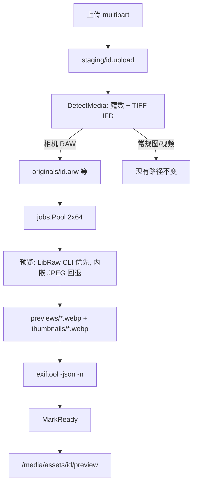

# Camera RAW 上传、解析与展示

| 字段 | 值 |
|---|---|
| 状态 | Implemented |
| 日期 | 2026-08-19 |
| 范围 | 上传识别、预览生成、前端选择器、Docker 运行时、CI 门禁 |
| 黄金夹具 | 仓库根目录 `test.ARW`（Sony ILCE-6400，约 24MB） |

## Overview

当前流水线不能可靠处理相机 RAW。Sony `.arw` 的文件头是 TIFF，`DetectFormat` 会把它存成 `.tiff`；Debian Bookworm 自带的 `libvips42` 没有 LibRaw，`vipsthumbnail` 无法按相机 RAW 解码。图库只展示处理后的 WebP，处理失败就没有图。

改造目标：按相机格式识别并保留原生后缀；先靠内嵌 JPEG 让 ARW 能入库出图，再用 LibRaw（生产走 `libraw-bin`，不编整份 vips）生成全尺寸预览；浏览器始终只显示 WebP；**识别单测和（后一阶段的）生产解码都必须用根目录 `test.ARW`，失败则对应 job 失败。**

## Background & Motivation

根目录夹具已验证：

| 项 | 值 |
|---|---|
| 路径 | `test.ARW`（git 已暂存；`test.arw` 是同一 inode 的大小写硬链接，不要再提交一份） |
| 大小 | 24MB |
| 文件头 | `49 49 2A 00`（little-endian TIFF）；IFD0 从 offset 8 起，19 个 tag |
| exiftool | `FileType=ARW`，`MIME Type=image/x-sony-arw`，`Make=SONY`，`Model=ILCE-6400` |
| 像素 | 6048×4024，Compression = Sony ARW Compressed（TIFF tag 32767） |
| 内嵌预览 | `PreviewImage` 约 513KB，JPEG 1616×1080 |
| 本机 Homebrew vips 8.18 | `vipsheader` → `6024x4024 ... dcrawload`，`vipsthumbnail` 可出 WebP |

现状断点：

1. `imageproc.DetectFormat`（`backend/internal/imageproc/processor.go`）只 `Peek(32)`，在 TIFF 魔数处返回。ARW/NEF/CR2/DNG 全部变成 `FormatTIFF`。32 字节里只有魔数和 IFD 偏移，读不到 Make。
2. `asset.formatInfo` 对已识别的 `FormatRAW`（RAF/CR3/ORF/RW2）走 default，落成 `.raw` + `application/octet-stream`；TIFF 误判则落成 `.tiff`。未知内容在 `DetectFormat` 就返回 `ErrUnsupportedFormat`，到不了 `formatInfo`。
3. `CommandProcessor.Process` 只调 `vipsthumbnail` 原文件，失败则整单失败，连 `exiftool` 都不跑。
4. Dockerfile 装了 `libraw20`，但 Bookworm `libvips42`（8.14）未链接 LibRaw，该包无效。缺的是用得上的 LibRaw **CLI**，不是再编一份 vips。
5. 前端 `accept="image/*"` 通常列不出 `.arw`；队列用 `URL.createObjectURL` 塞进 ``，浏览器解不了。
6. `.github/workflows/pipeline.yml` 的 `make check` 不装 vips/exiftool，也没有真实 RAW 夹具断言。

夹具继续放在根目录文件 `test.ARW`，因为文件已经暂存、只需一份、不走 Git LFS。这 **不是** `check-release` 的约束：`check-release` 只禁止根目录再出现除 `backend` / `frontend` / `docs` 以外的**目录**，`backend/testdata/test.ARW` 完全合法，也更符合 Go 习惯。v1 不搬，避免无谓移动 24MB blob；若以后要迁，迁到 `backend/testdata/`，不要新建根目录 `testdata/`。

## Goals & Non-Goals

**Goals**

- 上传 Sony ARW（以及下表其它常见 RAW）能入库，状态走到 `ready`。
- 原片以相机后缀保存（`.arw` 等），MIME 用具体类型，不再写成 `.tiff` / `.raw`。
- 生成可展示的 WebP 预览和缩略图；公开页、后台、预览页都不在浏览器里解 RAW。
- 写出相机、镜头、拍摄时间等 EXIF；EXIF 提取与预览生成解耦；EXIF 失败不挡住能看的图。
- `test.ARW` 锁识别单测（一开始就上）；生产镜像的全尺寸 LibRaw 解码作为**后一阶段**硬门禁（宽度 ≥ 6000）。
- JPEG / PNG / WebP / HEIF / 真 TIFF / 视频路径不回归。

**Non-Goals**

- 浏览器端 RAW 显影、调色、直方图。
- 在线 RAW 编辑或 DNG 转换。
- 为每一种冷门 RAW 做单独显影配置。
- 把 24MB 夹具迁到 Git LFS（单文件可接受；若以后再加多份再评估）。
- 改 `assets` 表结构（现有 `mime_type` / `original_key` / `exif_json` 足够）。
- 首发在生产镜像里从源码编译 libvips（见 Alternatives E）。

## Proposed Design



预览和 EXIF **顺序执行**：先出 WebP，再抽 EXIF。EXIF 失败仍 `MarkReady`，字段留空。RAW 仍是普通图片 asset：`processing` → 出 WebP → `ready`。不新增媒体类型。

### 1. 格式识别

把「一种 Format」拆成检测结果，避免 `FormatRAW` 再落到 `.raw`。

```go
type Detection struct {
    Family    Format // jpeg | png | webp | heif | tiff | raw | 由调用方再判 video
    Kind      string // arw, nef, cr2, cr3, raf, dng, orf, rw2, pef, tiff, ...
    Extension string // .arw
    MIMEType  string // image/x-sony-arw
}
```

`DetectFormat(io.Reader)` 升级为：

```go
func DetectMedia(r io.ReadSeeker) (Detection, error)
```

**必须是 `io.ReadSeeker`。** 当前 `Peek(32)` 读不到 IFD 里的 Make / Compression。上传路径里 staging 已是可 seek 的文件：`Upload` 重新打开 staging，传入 `*os.File`。单测用 `bytes.NewReader`（本身是 `ReadSeeker`），构造**完整**的迷你 TIFF（IFD0 + Make/DNGVersion/Compression 的数据区），不能只写 4 字节魔数。

算法：

1. 先匹配非 TIFF 的明确签名：JPEG / PNG / WebP / HEIF brand / RAF / CR3 / ORF / RW2。
2. TIFF 魔数 `II*\0` 或 `MM\0*`：按偏移解析 IFD0（至少读 Make `0x010F`、DNGVersion `0xC612`、Compression `0x0103`、SubIFD `0x014A`；UniqueCameraModel `0xC614` 可作辅助，不是分支条件）。Sony ARW 的 IFD0 Compression 常是 6（内嵌 JPEG），真正的 32767 在 SubIFD；实现会再读 SubIFD，用其中非 1/5/8 的 Compression 做 Kind 判断。
   - 有 `DNGVersion` → `dng` / `image/x-adobe-dng`（不论 Compression）
   - 否则：相机 Make **并且** Compression **不是** 普通静止 TIFF（1 Uncompressed / 5 LZW / 8 Adobe Deflate）→ 按下表 Kind
     - Make 含 `SONY` 且 Compression=32767（Sony ARW Compressed，通常在 SubIFD）→ `arw` / `image/x-sony-arw`
     - Make 含 `NIKON` 且 Compression=34713 → `nef` / `image/x-nikon-nef`
     - Make 含 `CANON` 且 Compression 不是 1/5/8（CR2 常见 6 Old JPEG）→ `cr2` / `image/x-canon-cr2`
     - Make 含 `PENTAX` / `RICOH` 且 Compression 不是 1/5/8 → `pef` / `image/x-pentax-pef`
   - Make 匹配相机但 Compression 是 1/5/8 → **真 TIFF**（避免 Canon 扫描仪 TIFF 收成 `.cr2`）
   - 未知 Make → 真 TIFF
3. 文件名后缀只做歧义打破，不能单独放行。`.arw` 改后缀的 JPEG 仍应被认成 JPEG。
4. 上面都不是再走现有 `detectVideoFormat`。

Sony 专名 compression 写进断言：`test.ARW` 必须同时满足 Make=SONY 与 Compression=32767。其它厂牌的具体值以单测里的迷你 IFD 为准；实现时若某厂常用值与上表不一致，改表并补测，不要靠「只要 Make 对就当 RAW」。

`test.ARW` 的预期结果：`Family=raw`，`Kind=arw`，`Extension=.arw`，`MIMEType=image/x-sony-arw`。当前实现会得到 `tiff` / `.tiff`，这就是要修的断言。

支持矩阵：

| Kind | 典型后缀 | 识别依据 | 首发是否必须 |
|---|---|---|---|
| arw | `.arw` | TIFF + Make=SONY + Compression=32767 | 是，CI 夹具 |
| nef | `.nef` | TIFF + Make=NIKON + Compression=34713 | 是（迷你 IFD 单测，无大文件） |
| cr2 | `.cr2` | TIFF + Make=CANON + 非 1/5/8 | 是（单测） |
| dng | `.dng` | TIFF + DNGVersion | 是（单测） |
| cr3 | `.cr3` | `ftyp` + `crx ` | 已有签名，补 MIME/后缀 |
| raf | `.raf` | `FUJIFILMCCD-RAW` | 已有签名，补 MIME/后缀 |
| orf | `.orf` | `IIRO` / `MMOR` | 已有签名，补 MIME/后缀 |
| rw2 | `.rw2` | `IIU\0` | 已有签名，补 MIME/后缀 |
| pef | `.pef` | TIFF + PENTAX/RICOH + 非 1/5/8 | 是（单测） |
| 未知 RAW | — | 无法识别 | 拒绝，`ErrUnsupportedFormat` |

`asset.formatInfo` 改为直接使用 `Detection.Extension` / `Detection.MIMEType`。CR3/RAF/ORF/RW2 不再掉进 default 变成 `.raw`。

### 2. 预览与 EXIF

`CommandProcessor.Process` 拆成顺序两步：先预览，再 EXIF。预览失败不再吞掉 EXIF；EXIF 失败也不回滚已经生成的 WebP。

**对 `Family=raw`，禁止对原片直接跑 `vipsthumbnail`。** Bookworm `libvips42` 会走 TIFF loader，读 IFD0 里 1616 的内嵌图并返回成功，看起来像处理好了，实际不是 LibRaw。本机 Homebrew 的 `dcrawload` 不能当生产假设。

**预览顺序**

1. **LibRaw CLI（全尺寸，生产默认）**：用 Debian `libraw-bin` 把原片解到临时目录里的 TIFF/PPM，再对**临时文件**跑现有 `vipsthumbnail`（预览最长边 2560 Q=85，缩略图 480 Q=80，`--rotate --export-profile srgb`）。生产与本机都优先 `simple_dcraw -T`，没有再试 `dcraw_emu -T`；输出按 `input.tiff` / `input.tif` / `input.ppm` 查找。夹具只读挂载时先拷到工作目录再解，避免写不进只读 volume。解完删临时文件。`test.ARW` 解出后最长边应 ≥ 6000（本机 vips 报 6024）。
2. **内嵌 JPEG 回退**：CLI 不存在、超时或失败时，`exiftool -b -PreviewImage`，若空再试 `-JpgFromRaw`、`-OtherImage`。`test.ARW` 有 1616×1080 预览。把 JPEG 写到 staging 临时文件，再跑现有 `vipsthumbnail`。
3. 两步都失败 → `ASSET_PROCESSING_FAILED`。

对 JPEG/PNG/WebP/HEIF/真 TIFF：仍直接 `vipsthumbnail` 原文件，行为与现在相同。

超时保持 2 分钟。LibRaw 解 24–80MB ARW 在单核上通常数秒到十几秒；临时 TIFF/PPM 可能到约 150MB，必须清掉。2 worker、队列长度 64 不变；避免一次入队几十张超大 RAW 即可。

**首发分两段落地（见 Rollout / PR Plan）：**

- 先合回退路径：没有 `libraw-bin` 时走步骤 2。`test.ARW` 能 `ready`，预览最长边 1616。用户可以开始传 ARW。
- 再合 `libraw-bin` + CI 全尺寸门禁：生产走步骤 1，预览拉到站点 2560。

**EXIF**：无论预览走哪条路径，都执行 `exiftool -json -n`。字段映射沿用 `parseExif`。`test.ARW` 至少应写出 `camera=ILCE-6400`、`shoot_at=2026-05-04T06:40:36Z`（按现有 `2006:01:02 15:04:05` → UTC 的解析；无时区则仍按 UTC）。

EXIF 命令失败或 JSON 解不开：**不**把 asset 标 `failed`，预览照常 `MarkReady`，EXIF 字段留空，打结构化日志。首发 **不要** 引入 `ASSET_EXIF_FAILED` 作为 `error_code`，避免后台把「能看的图」显示成失败。以后若要区分，再加仅用于日志/指标的码。

错误码：

| 码 | 含义 |
|---|---|
| `ASSET_PROCESSING_FAILED` | 预览两条路径都失败 |

### 3. Docker 运行时

生产镜像必须能对 `.arw` 走 LibRaw 全尺寸解码，不能把内嵌 JPEG 当成「能解 RAW」的证明。但 **v1 不在镜像里编译 libvips**。

**默认（v1）：** 继续用发行版 `libvips42` / `libvips-tools` / `libheif1` / `libimage-exiftool-perl`，去掉无效的单独 `libraw20`，改为装 **`libraw-bin`**（会带上 `libraw20`）。处理进程用上一节的 CLI → 临时文件 → `vipsthumbnail`。

这样：

- 不引入 meson / g++ / 一堆 `-dev`
- 不拉长 `fresh-start` 和多架构 `build-and-push`
- HEIF/JPEG/WebP 继续走发行版 vips，回归面小
- CI 断言打在 LibRaw CLI 的输出宽度上，而不是 `vipsheader test.ARW`（Bookworm 对 `.ARW` 会走 tiffload，宽度可能是 1616，会假通过或假失败）

**不要做：** 在 runtime 阶段 `apt-get install` 编译器后现场编 libvips。那会把 slim 镜像撑到接近 builder，且容易漏编 heif/webp。

若以后要让 `vipsthumbnail` 直接吃 RAW（与 Homebrew 的 `dcrawload` 对齐），走 Alternatives E：单独 builder 阶段编钉版本的 libvips+libraw，只拷运行用的 `.so` 和工具进 slim。那是可选升级，不是首发。

### 4. 前端

`frontend/src/features/assets/upload-panel.tsx` 的 `accept` **关键是后缀**。浏览器文件选择器认 `.arw` / `.ARW`，几乎不认 `image/x-sony-arw`。MIME 可以附带，不要当成能打开选择器的条件：

```text
image/*,.arw,.ARW,.nef,.NEF,.cr2,.CR2,.cr3,.CR3,.raf,.RAF,.dng,.DNG,.orf,.ORF,.rw2,.RW2,.pef,.PEF,
video/mp4,video/webm,video/quicktime,.mov
```

`beforeUpload` 仍不按 MIME 拦截（拖拽继续可用）。队列里若 `file.name` 匹配 RAW 后缀，或 `file.type` 为空且后缀是 RAW：不要用 object URL 当 ``，改成「RAW」占位，等服务端 `ready` 后再靠列表刷新看缩略图。

`readReferenceExif`（exifreader）只用于编辑弹窗的「导入参考 EXIF」，对 ARW 不是必须；服务端 exiftool 才是权威来源。

### 5. 文档与本地开发

- README：支持的 RAW 列表；本地需要 `exiftool`，以及 `libraw-bin`（或 Homebrew `libraw`）才能走全尺寸预览。本机若已有带 LibRaw 的 `vips`，只用于开发者自查（`vipsheader`），**应用进程仍走 CLI + 回退**，与生产一致。
- `docs/architecture/system-architecture.md`：处理步骤补上 RAW 识别、LibRaw CLI、内嵌 JPEG 回退。
- 运行时不在 `/health/ready` 里强依赖 LibRaw（避免工具缺失导致整站起不来）；缺 CLI 时走 JPEG 回退，两条都失败走现有 `failed` + 重试。

## API / Interface Changes

对外 HTTP 契约不变：`POST /api/v1/admin/assets` 仍是 multipart，`202` + `id/status`。变化在服务端识别结果：

| | 现在（对 test.ARW） | 改造后 |
|---|---|---|
| `original_key` | `originals/<id>.tiff` | `originals/<id>.arw` |
| `mime_type` | `image/tiff` | `image/x-sony-arw` |
| `status`（处理完） | 多为 `failed` | `ready` |
| `preview_url` / `thumbnail_url` | 空 | WebP |
| `camera` | 空 | `ILCE-6400` |

原图下载 `Content-Disposition` 继续用 `OriginalName`（用户上传名，大小写保持）。磁盘后缀统一小写 `.arw`。

内部：`DetectFormat(io.Reader) (Format, error)` 换成 `DetectMedia(io.ReadSeeker) (Detection, error)`；`formatInfo` 改为使用 Detection 上的后缀和 MIME。调用点在 `asset.Service.Upload`：对 staging 文件重新打开后再检测。

## Data Model Changes

无 migration。`assets.mime_type`、`original_key`、`exif_json`、`camera` 等现有列即可。已失败的历史 ARW 可用后台「重试」走新处理逻辑，无需数据回填脚本。

## CI 门禁（硬性）

夹具：仓库根目录 `test.ARW`。测试和 workflow 写这个确切文件名（Linux CI 区分大小写，不要写 `test.arw`）。

分两层。层 A 一开始就上；层 B 跟生产 LibRaw（PR 4）一起上，**不要**在还没有 CLI 时把 `fresh-start` 涂红。两层都禁止 `t.Skip`。

### A. `make check` / `check` job：识别契约

GitHub `ubuntu-latest` 的发行版 vips 没有可靠 LibRaw，**不要**在这个 job 里当生产解码器，也 **不要** 为识别测试安装 `exiftool` / `libraw-bin`。这个 job 只保证纯 Go 契约：

1. 新增 Go 测试，用固定相对路径打开仓库根的 `test.ARW`（相对 `backend/internal/imageproc` 为 `../../../test.ARW`）。抽一个 `RawARWPath(t)`：从调用方工作目录和源文件目录向上找，停在「本层有 `test.ARW` 且同层或下一层有 `backend/go.mod`」。文件不存在 → **Fatal**，不是 Skip。
2. 断言：
   - `DetectMedia` → Kind=`arw`，Extension=`.arw`，MIME=`image/x-sony-arw`
   - **不是** `tiff`，也不是 `ErrUnsupportedFormat`
3. 用完整迷你 IFD（含 Make / Compression / DNGVersion 数据区）覆盖：
   - NEF / CR2 / DNG → 对应 Kind
   - Make=Canon 且 Compression=1（或 5/8）→ **tiff**，防止扫描仪 TIFF 被收成 cr2
   - 无 Make 的真 TIFF → tiff
   - 4 字节 TIFF 魔数、无 IFD → tiff 或明确错误，不得 panic

`Makefile check` 保持 `go test ./...`。没有 `test.ARW` 时本地 `make check` 必须失败，避免有人误删夹具还以为测试绿了。

处理顺序（LibRaw → JPEG 回退 → EXIF 降级）用 mock `Runner` 单测，不依赖本机工具。

### B. `fresh-start` job：生产镜像必须解开 `test.ARW`（跟 PR 4 一起加）

现有 job 已经 `docker build` 出 `bophotos-ci:local`。在「Verify startup and restart」**之前**增加一步，用**镜像内**的 LibRaw CLI + `vipsthumbnail` + `exiftool` 跑夹具。镜像解不出全尺寸，PR 不能合。

不要对原片跑 `vipsheader` / `vipsthumbnail`：Bookworm vips 会走 TIFF loader。也不要在 slim 里装 `python3`。

```yaml
- name: Decode test.ARW inside production image
  run: |
    set -euo pipefail
    test -f test.ARW
    docker run --rm \
      --volume "$PWD/test.ARW:/fixture/test.ARW:ro" \
      --entrypoint bash \
      bophotos-ci:local \
      -lc '
        set -euo pipefail
        filetype=$(exiftool -s3 -FileType /fixture/test.ARW)
        test "$filetype" = "ARW"
        model=$(exiftool -s3 -Model /fixture/test.ARW)
        test "$model" = "ILCE-6400"
        command -v simple_dcraw >/dev/null || command -v dcraw_emu >/dev/null
        cp /fixture/test.ARW /tmp/test.ARW
        if command -v simple_dcraw >/dev/null; then
          simple_dcraw -T /tmp/test.ARW
        else
          dcraw_emu -T /tmp/test.ARW
        fi
        decoded=$(ls /tmp/test.ARW.tiff /tmp/test.ARW.tif /tmp/test.tiff /tmp/test.ARW.ppm 2>/dev/null | head -n 1)
        test -n "$decoded"
        test -s "$decoded"
        header=$(vipsheader "$decoded")
        echo "$header"
        width=$(echo "$header" | sed -n "s/^\([^:]*\): \([0-9]*\)x.*/\2/p")
        test "$width" -ge 6000
        vipsthumbnail "$decoded" \
          --size 480x480\> \
          --rotate \
          --export-profile srgb \
          --output /tmp/raw-ci.webp[Q=80,strip]
        test -s /tmp/raw-ci.webp
        # Bookworm slim 无 python3：读 RIFF....WEBP 魔数
        hexdump -C -n 12 /tmp/raw-ci.webp | grep -q "RIFF"
        hexdump -C -s 8 -n 4 /tmp/raw-ci.webp | grep -q "WEBP"
      '
```

说明：

- 宽度断言打在 **LibRaw 解出的临时图** 上，锁死全尺寸，避免 TIFF loader 读 1616 内嵌图却绿灯。
- 命令名用 `simple_dcraw` / `dcraw_emu` 二选一，实现 Dockerfile 时先在 Bookworm 上确认包内实际二进制，再把 script 收成单一命令。
- WebP 魔数用 `hexdump`，不要为 CI 往运行镜像里装 Python。

可选加强（同一 job、容器起来并完成管理员初始化之后）：登录 → `POST /api/v1/admin/assets` 上传 `test.ARW` → 轮询直到 `ready` → `GET /media/assets/{id}/preview` 为 WebP。这覆盖 Go 上传识别 + 队列。作为第二步，不替代上面的全尺寸宽度断言。注意：只测「能 ready + 是 WebP」过不了「不是 1616 假成功」；全尺寸仍靠 CLI 那步。

`build-and-push` 已 `needs: [check, fresh-start]`，层 B 失败不会出镜像、不会部署。

## Alternatives Considered

**A. 只抽内嵌 JPEG，永远不跑 LibRaw**

- 优点：Dockerfile 几乎不动；`test.ARW` 有 1616×1080 预览。
- 缺点：预览最长边 1616，低于站点 2560；没有预览的 RAW 会失败；CI 证明不了「能解 RAW」。
- 结论：作**先合的回退路径**和运行时兜底，不作唯一路径。

**B. 换更新的 Debian，赌发行版 vips 带 LibRaw**

- 优点：少维护源码编译。
- 缺点：Bookworm 明确没有；Trixie 是否 `--enable-libraw` 不稳定，升级 base 还要重验 heif/exiftool。
- 结论：不作为首发。

**C. 上传时用 exiftool `-FileType` 识别，不写 TIFF IFD 解析**

- 优点：实现快，覆盖面广。
- 缺点：上传热路径多一次进程；CI/单测绑 exiftool；staging 还没决定后缀。
- 结论：IFD 解析做主路径，exiftool 只用于处理阶段元数据。

**D. 浏览器用 wasm 解 RAW 做队列预览**

- 优点：上传当下能看图。
- 缺点：体积和 CPU 都不合适。
- 结论：不做，占位即可。

**E. 从源码编译 libvips ≥ 8.16（`-Dlibraw=enabled`），让 `vipsthumbnail` 直接吃 RAW**

- 优点：与本机 Homebrew `dcrawload` 同一条命令；少一个临时 TIFF；色彩走 vips+lcms。
- 缺点：要 meson/ninja 和 jpeg/png/webp/tiff/heif/lcms/libraw 等 `-dev`；多架构每次多编数分钟到十几分钟；漏一个 loader 就会回归 HEIF/JPEG。若在 **runtime** 阶段编，slim 镜像会带上编译器。
- 若以后做：单独 **builder** 阶段，钉 libvips 与 libraw 版本，meson 显式打开 jpeg/png/webp/tiff/heif/lcms/libraw，只把运行用 `.so`、`vipsthumbnail`、`vipsheader` 拷进 slim。`fresh-start` 的宽度断言可改回对原片 `vipsheader` 并匹配 `dcraw|rawload|libraw`。
- 结论：不作为 v1。v1 用已有的 `libraw-bin`。

**F. 对 RAW 原片直接 `vipsthumbnail`（指望 vips 自己选 loader）**

- 优点：代码与 JPEG 完全相同。
- 缺点：Bookworm 会 tiffload 成功并交出 1616 图，CI 若只检查「出了 WebP」会假通过。
- 结论：禁止。`Family=raw` 必须先走 LibRaw CLI 或内嵌 JPEG 抽出的独立文件。

## Security & Privacy

- 识别只读文件头和 IFD，不执行嵌入数据。
- 原片仍按现有可见性 / 隐私 / 管理员规则走 `/media`；RAW 原片默认不当 `` 源。
- 24MB 夹具是真实照片（机身 ILCE-6400，拍摄时间 2026-05-04）。**合入前必须确认画面可公开**；若不能公开，换成可发布的 Sony ARW，并保持同样断言（Make/Model/Compression/宽度 ≥ 6000）。这是合入阻塞项，见 Open Questions。
- 生产不编译 libvips，供应链面就是 Debian `libraw-bin` 的常规安全更新。若走 Alternatives E，必须钉版本。

## Observability

- `Process` 打结构化日志：`asset_id`、`kind`、`preview_path`（`libraw` | `embedded_jpeg`）、耗时、错误。
- 现有 `failed` + `error_code` 足够后台展示；可区分以后再加 `ASSET_RAW_DECODE_FAILED`。
- EXIF 失败只打日志，不写 `error_code`。
- CI 层 B 失败时打印 LibRaw CLI 输出、`vipsheader`（对**解码后的临时图**）和 `exiftool -FileType -Model`。

## Rollout Plan

1. 合识别 + `test.ARW` 单测（`check` 开始锁 Kind=arw）。此时生产仍解不出图，但不再存成 `.tiff`。
2. 合预览回退 + EXIF 解耦。没有 LibRaw 时 `test.ARW` 也能 `ready`（1616 预览）。**这一步先给用户价值**，不要等 Docker。
3. 合前端 `accept` 后缀与队列占位（可与 1–2 并行）。
4. 合 Dockerfile `libraw-bin` + `fresh-start` 全尺寸解码步。这一步才把「宽度 ≥ 6000」涂成硬门禁；之前不要加这条以免整条流水线红。
5. 无需 feature flag：处理失败可重试；旧 JPEG 路径不变。
6. 回滚：去掉 `libraw-bin` 会让层 B 失败，不能悄悄回滚。回退路径仍在，临时回滚层 B 的话用户至少还能看到内嵌预览。

## Risks

| 风险 | 级别 | 缓解 |
|---|---|---|
| TIFF IFD 把真 TIFF 误判成 RAW | 高 | DNGVersion 优先；相机 Make **加** 非 1/5/8 Compression；Canon+Compression=1 单测必须是 tiff |
| 发行版 vips 读 IFD0 小图却当成功 | 高 | RAW 不对原片跑 `vipsthumbnail`；CI 量的是 LibRaw 临时图宽度 ≥ 6000 |
| `libraw-bin` 命令名/输出后缀与文档不一致 | 中 | 实现前在 Bookworm 上确认二进制和输出路径；CI script 写成单一命令 |
| 临时 TIFF/PPM 约 150MB 占盘 | 中 | 写进 staging/tmp，成功或失败都删；超时 2 分钟 |
| 2 worker 解大 RAW 导致队列堆积 | 中 | 2 分钟超时；失败可重试；后续再限 RAW 并发 |
| 24MB 进 git 克隆变慢 | 低 | 仅一份夹具；不建根目录 testdata |
| 根目录大小写：macOS 不敏感、CI 敏感 | 中 | 只跟踪 `test.ARW`；测试和 workflow 写死这个名字 |
| 夹具含不能公开的画面 | 高 | 合入前人工确认；不能公开就换样张 |
| 源码编 vips 拉长 Docker / 漏 loader | — | v1 不做；见 Alternative E |

## Open Questions

1. **`test.ARW` 画面是否可公开进 git？** 机身 ILCE-6400，拍摄 2026-05-04 06:40:36。不能公开则换成可发布的 Sony ARW，并保持 Make / Model / Compression=32767 / 全尺寸 ≥ 6000 的断言。未确认前不要把夹具合进 `main`。

夹具路径（根目录 `test.ARW`）、先回退后全尺寸、生产用 `libraw-bin` 不编 vips，这三点按本次评审定下来，不再作为开放问题。

若以后要换夹具：保持 Sony ARW、全尺寸 ≥ 6000、exiftool `FileType=ARW`、Compression=32767，并改 CI 里的 Model 断言。

## Key Decisions

1. **RAW 仍是普通图片 asset**，只改识别和处理器；不加表、不改 API 形状。
2. **TIFF 容器 RAW 按相机 Kind 落盘**（`.arw` + `image/x-sony-arw`），禁止 `.tiff` / 通用 `.raw`。
3. **`DetectMedia` 吃 `io.ReadSeeker`**，解析 IFD0；DNGVersion 优先，相机 Kind 需要 Make **加** 非标准 Compression，避免扫描仪 TIFF 误判。
4. **预览分两段：** 先合内嵌 JPEG 回退让 ARW 能 `ready`；再合 LibRaw 全尺寸。EXIF 独立且失败降级，不引入 `ASSET_EXIF_FAILED`。
5. **对 RAW 原片禁止直接 `vipsthumbnail`**，防止 Bookworm TIFF loader 用 1616 内嵌图假成功。
6. **生产默认装 `libraw-bin` 做全尺寸解码**，继续用发行版 `libvips42`。不在 runtime 编 libvips；源码编 vips 是可选后续（Alternative E），且必须多阶段 + 钉版本。
7. **`test.ARW` 留在仓库根目录**（已暂存，不是因为 `check-release` 不能放进 `backend/testdata`）。识别单测一开始就 Fatal；全尺寸解码门禁跟 `libraw-bin` 一起上，打在 CLI 输出宽度 ≥ 6000 上。
8. **前端不解码 RAW**，`accept` 以后缀为准，队列用占位。

## PR Plan

### PR 1: 识别 ARW/其它 TIFF 容器 RAW，并用 test.ARW 锁单测

- 影响：`backend/internal/imageproc/processor.go`、`processor_test.go`、`backend/internal/asset/service.go`、`service_test.go`、夹具查找小函数
- 依赖：无
- 内容：`Detection` + `DetectMedia(io.ReadSeeker)` + IFD（Make + Compression + DNGVersion）；`formatInfo` 用 Detection 字段；`DetectMedia(test.ARW)` 断言 arw；迷你 IFD 覆盖 NEF/CR2/DNG/真 TIFF/Canon+Compression=1。合入后 `make check` 在未改检测前会红，本 PR 必须带实现。

### PR 2: 预览回退 + EXIF 解耦（先给用户价值）

- 影响：`backend/internal/imageproc/commands.go`、`commands_test.go`、`backend/internal/asset/service.go`
- 依赖：PR 1（识别成 RAW 之后才走 RAW 预览分支）
- 内容：`Family=raw` 时不对原片 `vipsthumbnail`；先尝试 LibRaw CLI（二进制不存在则跳过），失败再抽 PreviewImage/JpgFromRaw/OtherImage；exiftool 独立，失败只打日志仍 `MarkReady`。mock runner 覆盖顺序。合入后生产即使还没有 `libraw-bin`，`test.ARW` 也能 `ready`。
- **不要**在本 PR 给 `fresh-start` 加宽度 ≥ 6000 断言。

### PR 3: 前端 accept 与队列占位

- 影响：`frontend/src/features/assets/upload-panel.tsx`、`upload-queue.ts`、必要的 CSS
- 依赖：无（可与 PR 1 并行）
- 内容：RAW **后缀**进入文件选择器；队列对 RAW 显示占位而不是坏图。

### PR 4: 生产镜像装 libraw-bin，CI 用 test.ARW 解全尺寸

- 影响：`Dockerfile`、`.github/workflows/pipeline.yml`、`README.md`
- 依赖：PR 2（处理进程已会调 CLI；本 PR 让镜像里有这个二进制）
- 内容：runtime 用 `libraw-bin` 替换无效的单独 `libraw20`；`fresh-start` 增加「镜像内 LibRaw CLI 解 test.ARW，宽度 ≥ 6000，再出 WebP」；README 写明依赖。**这是「解不出全尺寸就不能过 CI」的主门禁。**

### PR 5: 架构文档与支持矩阵

- 影响：`docs/architecture/system-architecture.md`、本文、`README.md` 支持格式表
- 依赖：PR 1–4 落地后核对事实（尤其是 Bookworm 上实际的 CLI 命令名和输出后缀）
- 内容：按实现回写架构描述，删掉过期假设。

## References

- 现有处理：`backend/internal/imageproc/commands.go`、`backend/internal/asset/service.go`
- 现有检测：`backend/internal/imageproc/processor.go`
- CI：`.github/workflows/pipeline.yml`、`Makefile`
- 夹具：`/test.ARW`（Sony ILCE-6400 ARW，拍摄 2026:05:04 06:40:36，Compression=32767）
- 架构现状：`docs/architecture/system-architecture.md`
