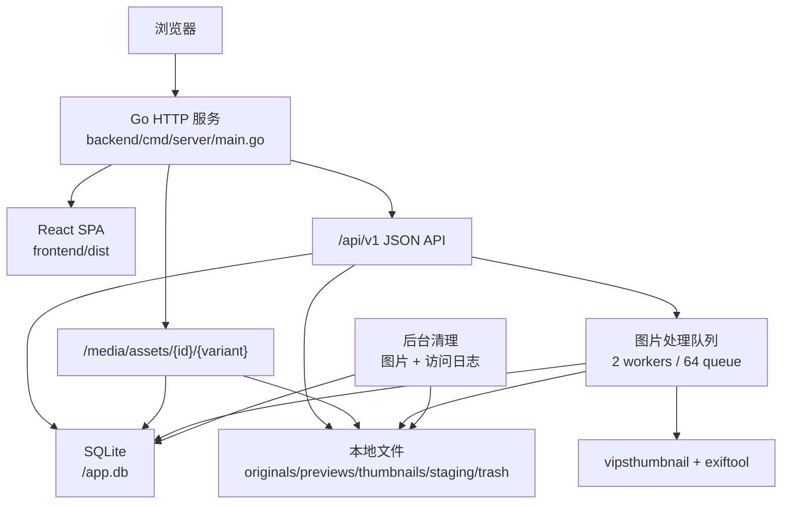

# 系统架构

本文描述当前代码已经实现的架构事实。运行入口以 `backend/cmd/server/main.go` 为准，接口以 `backend/openapi/openapi.yaml` 为准，数据库结构以 `backend/migrations` 为准，前端路由以 `frontend/src/app/router.tsx` 为准。

## 总体结构

BoPhoto 是一个单进程 Web 服务：Go 后端负责 API、媒体文件、健康检查和前端静态资源；React 前端构建后由 Go 服务托管；SQLite 和媒体文件都保存在本地数据目录。



生产链路：

```text
frontend 构建产物 -> Go 静态托管 + REST API -> /data 中的 SQLite 和媒体文件
```

## 技术栈

前端：

- React 19、React DOM 19、TypeScript 6。
- Vite 8。
- React Router 7。
- TanStack Query 5。
- Ant Design 6。
- Tailwind CSS 4。

后端：

- Go 1.24。
- chi 路由。
- SQLite。
- golang-migrate 嵌入式迁移。
- alexedwards/scs SQLite Session。
- Argon2id 密码哈希。
- 本地文件存储。
- vipsthumbnail 和 exiftool 图片处理。

部署：

- Docker 使用 Node 阶段构建前端，Go 阶段编译后端，最终运行 Debian slim 镜像。
- 运行镜像不需要 Node.js，也不需要外部数据库。

## 配置

配置读取逻辑位于 `backend/internal/config/runtime.go`。

| 环境变量 | 默认值 | 说明 |
|---|---|---|
| `BOPHOTOS_ADDR` | `:8080` | HTTP 监听地址 |
| `BOPHOTOS_DATA_DIR` | `/data` | SQLite 和媒体文件根目录 |
| `BOPHOTOS_FRONTEND_DIR` | `frontend/dist` | 前端构建产物目录 |
| `BOPHOTOS_COOKIE_SECURE` | `false` | Session Cookie 的 Secure 标记 |
| `BOPHOTOS_MAX_UPLOAD_BYTES` | `2147483648` | 单文件上传大小上限 |
| `BOPHOTOS_INITIAL_PASSWORD` | 无 | 空数据目录首次启动时的管理员密码 |

SQLite 固定写入 `<BOPHOTOS_DATA_DIR>/app.db`。

## 请求路由

根路由在 `backend/internal/api/router.go` 中创建。

```text
GET /health/live
GET /health/ready
/api/v1
  /auth
  /public
  /admin
/media
  /assets/{id}/{variant}
其他非保留 GET/HEAD 路径 -> SPA fallback
```

保留路径为 `/api`、`/media` 和 `/health`。这些路径下不存在的资源返回 JSON 404；其他浏览器路径交给 `backend/internal/frontend/handler.go` 返回前端页面。

本地开发时，`frontend/vite.config.ts` 会把 `/api`、`/media` 和 `/health` 代理到 `http://127.0.0.1:8080`。

## API

OpenAPI 文件位于 `backend/openapi/openapi.yaml`，统一前缀为 `/api/v1`。

- `/auth`：登录、登出、当前会话。
- `/public`：公开图片、相册、标签、站点设置和访问记录。
- `/admin`：需要登录的图片、相册、标签、仪表盘、统计、设置、磁盘用量和密码管理。

前端请求封装在 `frontend/src/api/client.ts`，默认携带同源 Cookie，并处理统一的成功和错误响应结构。

## 前端路由

路由定义位于 `frontend/src/app/router.tsx`。

公开页面：

- `/`
- `/gallery`
- `/gallery/:album`
- `/albums`
- `/covers`
- `/about`
- `/preview/:id`
- `/:album`

登录和后台：

- `/login`
- `/setup`，重定向到 `/login`
- `/admin/*`，由 `AdminRoute` 保护

## 数据库

迁移文件位于 `backend/migrations`，启动时自动执行。SQLite 打开逻辑位于 `backend/internal/repository/database.go`，启用了外键、WAL、busy timeout，并限制最大连接数。

主要表：

- `administrators`：管理员密码状态。
- `sessions`：Session 存储。
- `configs`：站点配置和内部配置。
- `assets`：图片元数据、处理状态、媒体路径、EXIF 信息和可见性。
- `albums`、`album_assets`：相册和相册图片排序。
- `tags`、`asset_tags`：标签树和图片标签。
- `visit_logs`：访问统计。

## 文件存储和图片处理

本地存储实现在 `backend/internal/storage/local.go`，根目录为 `BOPHOTOS_DATA_DIR`。

目录结构：

- `originals`：原图。
- `previews`：预览图。
- `thumbnails`：缩略图。
- `staging`：上传暂存。
- `trash`：待清理文件。

上传流程：

1. 文件先写入 `staging/<assetID>.upload`。
2. 计算 SHA-256，并检查上传大小。
3. 识别格式后移动到 `originals/<assetID>.<ext>`。
4. 创建处理任务，生成 WebP 预览图和缩略图。
5. 提取 EXIF，更新图片为 `ready` 状态。

图片处理队列当前为 2 个 worker，队列长度 64。队列不可用或处理失败时，图片会进入失败状态。

## Session 和权限

Session 配置位于 `backend/internal/auth/session.go`。

- Cookie 名称：`bophotos_session`。
- 总有效期：24 小时。
- 空闲超时：30 分钟。
- `HttpOnly`：开启。
- `SameSite`：Lax。
- `Secure`：由 `BOPHOTOS_COOKIE_SECURE` 控制。

`/api/v1/admin` 下的接口需要管理员 Session。媒体接口也会读取 Session，用于判断管理员是否可以访问隐藏图片或受限制的原图。

## 媒体访问

媒体接口位于 `backend/internal/media/http.go`。

路径格式：

```text
/media/assets/{id}/{variant}
```

支持的 `variant`：

- `thumbnail`：缩略图。
- `preview`：预览图。
- `original`：原图下载。

公开访问时，已删除、已清理、未处理完成或隐藏的图片会返回 404。原图下载是否公开由站点设置控制，管理员不受该限制。

## 访问统计

访问统计实现在 `backend/internal/site/site.go`，数据写入 `visit_logs`。

`POST /api/v1/public/visits` 会在统计开启时记录访问。系统保存路径、页面类型、User-Agent、来源和时间；IP 不明文保存，而是使用配置中的盐做 HMAC-SHA256 哈希。

后台会聚合访问量、独立访客、访问来源、页面类型、小时分布、相机和镜头等统计数据。

## 后台清理

服务启动后会运行两类清理任务：

- 图片清理：启动时执行一次，之后每小时执行。清理过期暂存文件、标记卡住的处理任务、清理长期删除的图片文件。
- 访问日志清理：每天执行，删除超过保留期限的统计记录。

服务关闭时，这些后台任务会随上下文取消而停止。
